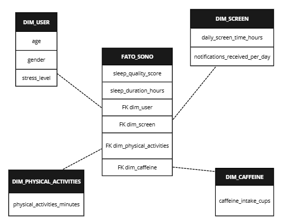

# Business Intelligence - Trabalho Final

### Impacto de Fatores no Sono (Cafeina, Telas e Exercícios)

### Campos Utilizados

- <u>Idade de Gênero</u>  
importante para identificar os usuários que responderam a pesquisa

- <u>Ocupação</u>  
tópico importante que pode influenciar, além do uso do celular, no sono das pessoas, já que é uma preocupação diária

- <u>Tempo diário em telas</u>  
tópico crucial analisado na pesquisa, já que impacta diretamente no sono dos entrevistados

- <u>Duração do sono (horas)</u>  
tópico principal da pesquisa, impactado pelo uso de telas

- <u>Copos de café</u>  
quantidade de copos de café tomada por entrevistado

#

### Data Warehouse -> Star Schema  

  

#

### Estrutura do Data Warehouse no SQL

```
-- =========================================
-- CRIAÇÃO DO SCHEMA (opcional)
-- =========================================

-- =========================================
-- DIM_USER
-- =========================================
CREATE TABLE sleep_dw.dim_user (
    id_user SERIAL PRIMARY KEY,
    age INT,
    gender VARCHAR(20),
    occupation VARCHAR(100),
    stress_level INT
);

-- =========================================
-- DIM_SCREEN
-- =========================================
CREATE TABLE sleep_dw.dim_screen (
    id_screen SERIAL PRIMARY KEY,
    daily_screen_time_hours NUMERIC(5,2),
    notifications_received_per_day INT
);

-- =========================================
-- DIM_CAFFEINE
-- =========================================
CREATE TABLE sleep_dw.dim_caffeine (
    id_caffeine SERIAL PRIMARY KEY,
    caffeine_intake_cups INT
);

-- =========================================
-- DIM_PHYSICAL_ACTIVITY
-- =========================================
CREATE TABLE sleep_dw.dim_physical_activity (
    id_physical_activity SERIAL PRIMARY KEY,
    physical_activity_minutes INT
);

-- =========================================
-- FATO_SLEEP
-- =========================================
CREATE TABLE sleep_dw.fato_sleep (
    id_fato SERIAL PRIMARY KEY,

    id_user INT,
    id_screen INT,
    id_caffeine INT,
    id_physical_activity INT,

    sleep_quality_score NUMERIC(3,1),
    sleep_duration_hours NUMERIC(4,2),

    -- FOREIGN KEYS
    CONSTRAINT fk_user FOREIGN KEY (id_user)
        REFERENCES sleep_dw.dim_user(id_user),

    CONSTRAINT fk_screen FOREIGN KEY (id_screen)
        REFERENCES sleep_dw.dim_screen(id_screen),

    CONSTRAINT fk_caffeine FOREIGN KEY (id_caffeine)
        REFERENCES sleep_dw.dim_caffeine(id_caffeine),

    CONSTRAINT fk_physical_activity FOREIGN KEY (id_physical_activity)
        REFERENCES sleep_dw.dim_physical_activity(id_physical_activity)
);
```

#

### <u>Perguntas de Negócio</u>  
> Qual a profissão de cada usuário?  
> O café implica no sono?  
> As notificações diárias impactam no sono?
> Há diferença no sono em cada gênero?
> Quantas pessoas há em cada gênero na pesquisa?  
> Qual gênero bebe mais café?  

#

<u>Justificativa de aplicar o BI</u>  
Na análise feita sobre Fatores que podem implicar no sono, pode ser avaliado fatores como telas, exercícios e o café, nesse mesmo modelo o gênero, stress e trabalho também podem impactar na qualidade do sono do úsuario. Com o BI ficá mais visual para entender a relação dessas métricas.

#

### Instalar Dependências

- pip install -r requirements.txt

### Run

- python etl_papeline.py
